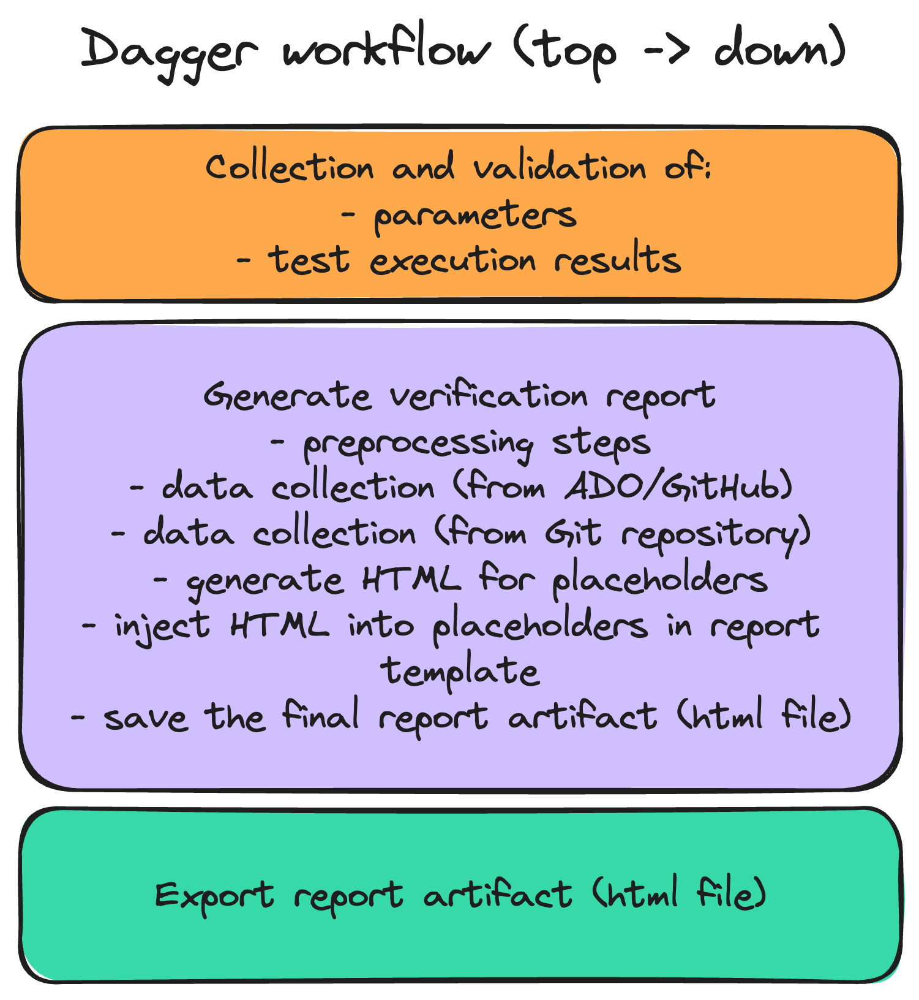
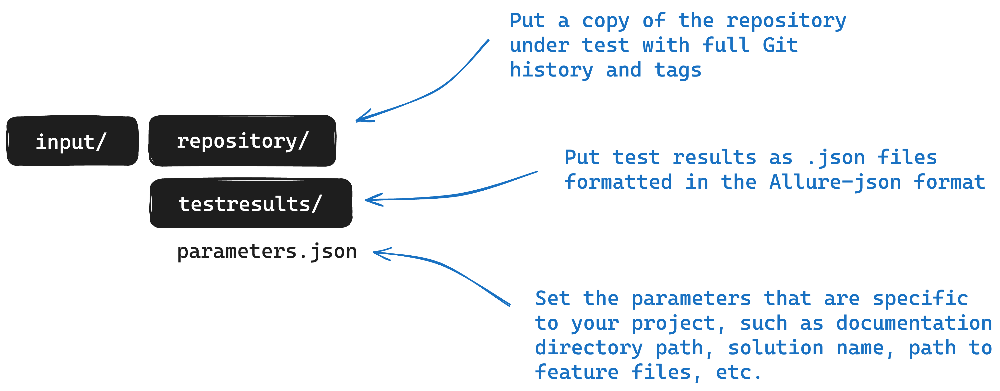

[](https://github.com/nn-dma/generate-verification-report/actions/workflows/run_unit_tests.yml) [](https://github.com/nn-dma/generate-verification-report/actions/workflows/run_integration_tests.yml) [](https://github.com/nn-dma/generate-verification-report/actions/workflows/run_github_action_test.yml)

# Who is this for?
Software developers who understand the QMS toolchain.

# What does this do?
This workflow is responsible for generating verification reports given metadata about the QMS pipeline run, the test results, and Git context.
It is intended to be called from within the GitHub action that generates a verification report as part of the QMS pipeline.

However, it can technically be invoked from anywhere capable of running Dagger and Docker Engine.

> It will only work with GitHub until further notice here. This is because some scripts communicate directly with the GitHub API. In the near future this will be extended to support Azure DevOps as well. These already exist elsewhere, but proper switching logic is not yet implemented here.



# How to use this?
First, go to the repository root `/`. Following paths mentioned are relative to this directory.

### Inputs

##### Parameters
Parameters are provided here by editing the `parameters.json` file. It is located in the `/input` directory *(not to be confused with the **`inputs`** directory inside `/src`, which is a Go package)*.

##### Environment variables
The Dagger workflow expects certain environment variables to be set. These are related to the runtime context and will be set automatically by the GitHub workflow. If you run the Dagger workflow locally they can be manually set and as described [here](doc/environment_variables.md).

##### Test results
Test results provided as input to the Dagger worklow must be placed in the `/input/testresults` directory. For now, the test results must be in the form of one JSON file per test case result and each must be in the Allure-format.

##### Git repository under test
The Git repository under test provided as input to the Dagger workflow must be placed into the `/input/repository` directory. It must contain information about remotes as well as the full history, i.e. it cannot be a shallow copy. It must be a valid Git repository.



### Outputs

Output from any run will be placed in a directory here called `/output`. The content in this will be the verification report HTML file.
Any output in this directory will be overwritten between runs unless the generated filename is different because of different intput parameters.

#### Logs

Logs will be written to a `src/run.log` file in the same place everytime the Dagger workflow is run. This file is appended between runs.

### Overriding default GitHub environment variables

 If you run the Dagger workflow locally or have a specific reason (like generating the verification report for a repository that is different from where the workflow is run) it will be necessary to override some of the default values of the environment variables. 
 
 This can be done by [setting override environment variables](doc/environment_variables.md#override-environment-variables) that the Dagger workflow will look for.

## Installed prerequisites
- golang (version: >=1.22.5)
- dagger runtime (version: >= 0.12.4)

Install with Homebrew, manually, or another package manager.

An additional requirement is that the executing host environment can reach the public Docker Hub image registry.

## Running the Dagger workflow
The production codebase lives in the `/src` directory.

From within the repository root `/`, run:

```text
dagger run go run -C src main.go
```

## Running tests
The test codebase lives in the `/test` directory and is consuming the production codebase. It is thus not part of the production codebase.

Two subgroups of tests exist: `unit tests` and `integration tests`. They have their own folders within `/test` and are run separately.

To execute unit tests , from within the repository root `/` run:

```text
go test -C test/unit -v
```

To execute integration tests , from within the repository root `/` run:

```text
go test -C test/integration -v
```

## Running workflows locally with `act`
The GitHub workflows can be executed locally with [act](https://github.com/nektos/act). Install with Homebrew or another package manager. Using `act` also requires Docker Engine to be installed.

When running the workflows locally, `act` might initially ask you which container size to use. *Medium* should work fine for the time being.

To execute the **unit tests** workflow, from within `/`, run:
```text
act --container-architecture linux/arm64 -W .github/workflows/run_unit_tests.yml
```

To execute the **integration tests** workflow, from within `/`, run:
```text
act --container-architecture linux/arm64 -W .github/workflows/run_integration_tests.yml
```
