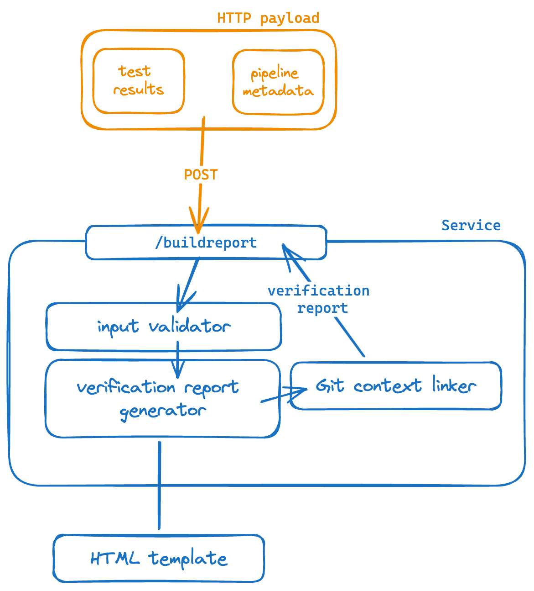

# Who is this for?
Software developers who understand the QMS toolchain.

# What does this do?
This service is responsible for generating verification reports given metadata about the QMS pipeline run, the test results, and Git context.

# How to use this?
> TODO

# Architectural overview

