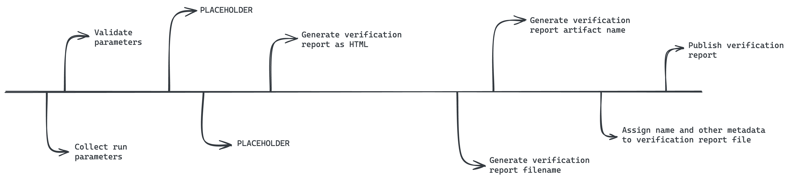

[](https://github.com/BI-Data-Management-And-Analytics/verification-report-service/actions/workflows/on_commit.yml)

# Who is this for?
Software developers who understand the QMS toolchain.

# What does this do?
This service is responsible for generating verification reports given metadata about the QMS pipeline run, the test results, and Git context.

# How to use this?
First, go to the `/src` directory.

Parameters are provided by editing the `parameters.json` file here.

Logs will be written to a `run.log` file in the same place everytime the Dagger workflow is run. This file is appended between runs.

Output from any run will be placed in a directory here called `output`. The content in this will be the verification report HTML file.
Any output in this directory will be overwritten between runs unless the generated filename is different because of different intput parameters.

> TODO: Determine hos test results are ingested—probably from an `input` directory.

## Installed prerequisites
- golang (version: >=1.21.6)
- dagger runtime (version: >= 0.9.8)

> The Dagger runtime is not required, but it renders nicer and logs are filtered properly when using it over:
> ```text
> go run main.go
> ```

## Running the Dagger workflow
The production codebase lives in the `/src` directory.

From within `/src`, run:

```text
dagger run go run main.go
```

## Running tests
The test codebase lives in the `/test` directory and is consuming the production codebase. It is thus not part of the production codebase.

From within `/test`, run:

```text
go test
```

# Generator workflow 

